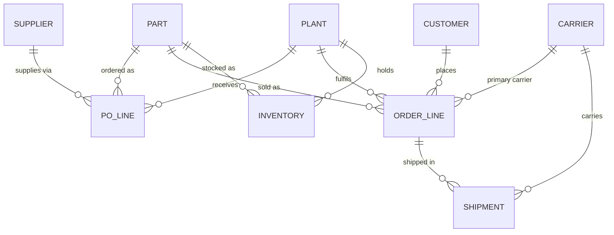

# Supply chain ontology with governed conversational analytics

**Challenge:** Supply Chain Ontology and Governed Conversational Analytics

Planning, Procurement and Logistics ask the same supply chain question and get different numbers, because each team defines the metric its own way. This project fixes that on Snowflake: one certified definition per metric, encoded as a **semantic view** (the ontology), a **governed natural-language layer** (Cortex Analyst) that can only answer through those definitions, and **automated proof** that every persona gets the same number.

## Judge access

| | |
| --- | --- |
| **Live app** | https://app.snowflake.com/ap-southeast-7.aws/ri04642/#/streamlit-apps/SC_ONTOLOGY.APP.SC_ONTOLOGY_APP |
| **Username** | `JUDGE` |
| **Password** | `Jdg#Ont0logy!2026xQ` |
| **Demo video** | [link to be added] |

The judge login can open the app only: no tables, worksheets or other objects. All data is synthetic. The app runs on an extra-small warehouse; the first load can take up to a minute while it starts.

### Try it in 5 minutes

1. **Before and after:** three teams' legacy numbers for the same plant and quarter, then a waterfall that explains the gap to the certified number one rule at a time.
2. **Persona face-off:** pick `unit_fill_rate` and click **Ask all three**. Three teams' wording, one certified number.
3. **Ask:** type your own question, for example:
   - `What was supplier OTD at Chennai last quarter?`
   - `Which 5 suppliers had the lowest supplier OTD at Chennai last quarter?`
   - `What was OTD at Chennai last quarter?` (ambiguous: it asks whether you mean supplier or customer OTD)
   - `Delete all late purchase orders for Chennai` (refused or blocked: the app runs read-only SQL only)
4. **Governance:** see the versioned rules and the change log. Please don't apply changes, so other judges see the same numbers.
5. **Consistency test:** the saved results of 29 natural-language test questions and 8 role-based entitlement tests.
6. **Metric catalog:** the ontology graph and each certified metric's definition, owner and version.

## What was built

```
RAW (ERP, supplier portal, TMS, WMS, IoT)      messy, SAP-style, as the sources really are
   │  crosswalk, units, time zones, FX, tolerance rules (parameters in GOVERNED.METRIC_PARAMETER)
CONFORMED (dims + facts, with lineage)          one golden supplier, units everywhere, plant-local dates
   │  SP_APPLY_METRIC_RULES re-applies rules in place; SP_CHANGE_METRIC_PARAMETER is the only way to change one
GOVERNED.SUPPLY_CHAIN_ONTOLOGY (semantic view)  9 entities, 13 relationships, certified metrics, synonyms
   │  row access by persona, price masking, tags
Cortex Analyst  →  Streamlit app  →  audit log, test history, change log
```



### Certified metrics

| Metric | Definition | Time anchor | Owner |
|---|---|---|---|
| Supplier OTD | Due PO lines received in full within −3/+2 days of the supplier-confirmed date | Confirmed date | Procurement Excellence |
| Customer OTD | Due order lines delivered in full (proof of delivery) by the commit date | Commit date | Customer Supply and Logistics |
| Unit fill rate | Units shipped by the commit date / units ordered, due lines ("fill rate" means this) | Commit date | S&OP Planning |
| Line fill rate | Due lines shipped complete by the commit date / due lines | Commit date | S&OP Planning |
| Days of inventory | On-hand value at standard cost / average daily cost of goods, trailing 90 days, excluding in-transit | Snapshot date | Finance Controlling |
| Landed cost | Goods + freight allocated by weight + duty + insurance + handling, USD | Receipt date | Finance Controlling |

### What makes it stand out

1. **The gap, explained.** `V_GAP_WATERFALL` walks from a team's legacy number to the certified number, one ontology rule per step. The last step is checked by SQL to equal the certified value.
2. **Definitions change live, in one place.** `SP_CHANGE_METRIC_PARAMETER` range-checks the value, requires a reason, bumps the parameter and metric versions, re-applies the rules and logs the scorecard before and after.
3. **It survives attack.** Hostile questions try to override a definition, change data or go off-topic; only read-only SQL ever runs. Entitlement tests run as each real role, with secondary roles off: out-of-scope plants return nothing, prices stay masked for Logistics, raw tables and rules are unreachable.
4. **Reproducible build.** The whole project was built with Snowflake Cortex Code (CoCo) from a project skill that holds the run order, the fix rules and the acceptance checks.

### Deliberate messiness in the synthetic data

| Planted problem | Rule that fixes it |
| --- | --- |
| 5 suppliers have two ERP vendor codes; every supplier has another ID in the portal | Crosswalk matches all IDs by tax ID to one golden supplier |
| Supplier-confirmed dates exist only in the portal | Confirmed date from the portal, requested date only as fallback |
| ERP goods-receipt posting lags physical arrival by 0–3 days | Arrival = RFID gate-in, goods receipt only when no read |
| Mexico has no gate readers; about 5% of reads missing elsewhere | Same fallback, with the arrival source kept as lineage |
| Some Japan and UK shipments recorded in boxes of 10 | Converted to units |
| Ship times plant-local, delivery times UTC | All converted to plant-local dates |
| Prices and freight in INR, JPY, GBP, USD | Converted to USD at monthly rates |

## Repository contents

| File | Purpose |
| --- | --- |
| `01_setup.sql` | Warehouse, database, schemas, steward and persona roles, Cortex access |
| `02_raw_sources.sql` | Synthetic ERP, supplier portal, TMS, WMS and IoT data with planted problems |
| `03_governance_registry.sql` | Parameters, metric registry, golden answers, persona test questions, audit tables |
| `04_conformed.sql` | Supplier crosswalk, dimensions, governed fact tables |
| `05_semantic_view.sql` | Semantic view `SUPPLY_CHAIN_ONTOLOGY` with Cortex instructions, canonical scorecard |
| `06_security.sql` | Row access by plant, price masking, tags, grants |
| `07_demo.sql` | Legacy team logic and before/after comparison |
| `08_gap_waterfall.sql` | Legacy-to-certified gap, one rule per step |
| `09_definition_change.sql` | Change log and the two governance procedures |
| `10_adversarial_tests.sql` | Hostile questions and role-based entitlement tests |
| `streamlit_app.py`, `snowflake.yml` | The app and its deploy config |
| `.cortex/skills/sc-ontology-build/SKILL.md` | The CoCo project skill: run order, fix rules, acceptance checks |

## Rebuild it yourself

Requires a Snowflake account (Enterprise edition, for row access and masking policies) in a region with Cortex Analyst, and the Cortex Code CLI.

1. Open a terminal in this folder and run `cortex`; pick your connection.
2. Check `/skill list` shows `sc-ontology-build`.
3. Prompt: `Use the sc-ontology-build skill. Build the whole project from 01 to 11 on this connection, run every acceptance check, and finish with one pass/fail table. Ask me before changing any business rule.`

Run steps one by one if you prefer; the skill lists each step's role and checks. After a quarter rolls over, rebuild 02, 04 and 06, then `CALL SC_ONTOLOGY.GOVERNED.SP_APPLY_METRIC_RULES();`.

## Notes

- Data is synthetic and generated relative to the build date, so "last quarter" always has data.
- The app's "Asking as" selector labels questions in the audit log; the app itself runs as the owner role. Per-persona access is proven by the entitlement tests in `10_adversarial_tests.sql`.
- The same design maps to Databricks Unity Catalog metric views and a Genie space.
