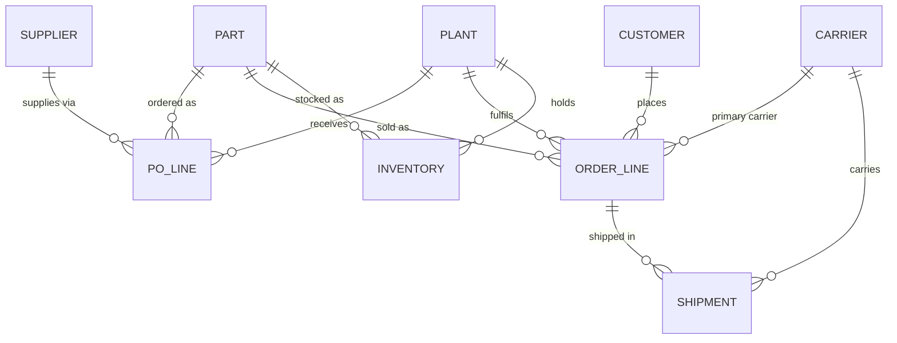

# Supply chain ontology with governed conversational analytics

The same supply chain question gets different answers from Planning, Procurement and Logistics because each team defines the metric differently. This project fixes that with an ontology encoded as a Snowflake Semantic View, a governed natural-language layer (Cortex Analyst), and tests proving that every persona gets the same number, that the gap to the old numbers is fully explained, that definitions change only in one governed place, and that the governance holds when someone tries to break it.

## Build it with CoCo

1. Open a terminal in this folder (PowerShell: `cd` into it first, then run `cortex`). Pick your Snowflake connection.
2. Check the project skill loaded: `/skill list` should show `sc-ontology-build`.
3. Paste these prompts one at a time and review the output before moving on.

**Base build (steps 1–7)**

```
/sc-ontology-build Run 01_setup.sql as ACCOUNTADMIN and show me the results.
```
```
Run 02_raw_sources.sql and 03_governance_registry.sql, then show the row counts.
```
```
Run 04_conformed.sql and show the sanity checks at the end.
```
```
Run 05_semantic_view.sql. If any clause is rejected, fix only syntax, tell me what you changed, and update the file.
```
```
Run 06_security.sql and 07_demo.sql, then run the acceptance checks from the skill and show them as one table.
```

**Stand-out features (steps 8–10)**

```
/sc-ontology-build Run 08_gap_waterfall.sql as SC_ADMIN and show me both check queries at the end.
```
```
Run 09_definition_change.sql as SC_ADMIN. Send each CREATE PROCEDURE statement whole. Then run the step 9 acceptance checks from the skill, including the change-and-revert test, and show the results.
```
```
Run 10_adversarial_tests.sql. Part A as SC_ADMIN. Part B: run each EXECUTE IMMEDIATE block as its own execution, starting with the USE ROLE line above it. Then show V_ENTITLEMENT_LATEST.
```

**App (step 11)**

```
I replaced streamlit_app.py. As SC_ADMIN, PUT it to @SC_ONTOLOGY.APP.APP_STAGE with AUTO_COMPRESS=FALSE OVERWRITE=TRUE, re-run CREATE OR REPLACE STREAMLIT for SC_ONTOLOGY.APP.SC_ONTOLOGY_APP as described in the skill, and show LIST @SC_ONTOLOGY.APP.APP_STAGE.
```

Then in Snowsight, open the semantic view under AI & ML > Cortex Analyst and save the five golden questions (one per metric, from `GOVERNED.CONSISTENCY_TEST_CASE`) as verified queries.

**On demo morning** run `CALL SC_ONTOLOGY.GOVERNED.SP_APPLY_METRIC_RULES();` as SC_ADMIN so the "due" flags use that day's date. If "last quarter" has rolled over since you built the data (for example the demo is in October and the data was built in September), rebuild 02 and 04, then 06, then call the procedure.

## Architecture

```
RAW (ERP, supplier portal, TMS, WMS, IoT)      messy, SAP-style, as the sources really are
   │  crosswalk, UoM, timezone, FX, tolerance rules (parameters in GOVERNED.METRIC_PARAMETER)
CONFORMED (dims + facts, with lineage)          one golden supplier, EA everywhere, plant-local dates
   │  SP_APPLY_METRIC_RULES re-applies rules in place; SP_CHANGE_METRIC_PARAMETER is the only way to change one
GOVERNED.SUPPLY_CHAIN_ONTOLOGY (semantic view)  entities, relationships, certified metrics, synonyms
   │  row access by persona, price masking, tags
Cortex Analyst  →  Streamlit app  →  audit log, test history, change log
```



## Certified metrics

| Metric | Definition | Time anchor | Owner |
|---|---|---|---|
| Supplier OTD | Due PO lines received in full within −3/+2 days of the supplier-confirmed date | confirmed date | Procurement Excellence |
| Customer OTD | Due order lines delivered in full (POD) by the commit date | commit date | Customer Supply and Logistics |
| Unit fill rate | Units shipped by commit date / units ordered, due lines ("fill rate" means this) | commit date | S&OP Planning |
| Line fill rate | Due lines shipped complete by commit date / due lines | commit date | S&OP Planning |
| Days of inventory | On-hand value at standard cost / average daily COGS, trailing 90 days, excluding in-transit | snapshot date | Finance Controlling |
| Landed cost | Goods + freight allocated by weight + duty + insurance + handling, USD | receipt date | Finance Controlling |

## What makes it stand out

1. **The gap, explained.** `V_GAP_WATERFALL` walks from a team's legacy number to the certified number, one ontology rule per step, and the last step is checked against the certified value. Judges see an audit trail, not a claim.
2. **Definitions change live, in one place.** `SP_CHANGE_METRIC_PARAMETER` validates the value against allowed ranges, requires a reason, bumps the parameter and metric versions, re-applies the rules in place (policies stay attached), and logs the scorecard before and after in `METRIC_CHANGE_LOG`. Every persona's answer moves together.
3. **It survives attack.** Hostile questions try to override a definition, change data or go off-topic, and the app only ever executes read-only SQL. Entitlement tests run as each real role: out-of-scope plants return nothing, prices stay masked, raw tables and parameters are unreachable.
4. **The ontology is visible.** The Metric catalog tab draws entities, relationships and each certified metric on its home entity.

## 7-minute demo

1. **The cost (30s).** One slide: what disagreement costs today (see below).
2. **The problem (45s).** Before and after tab: three teams, three numbers for Chennai last quarter.
3. **The gap, explained (60s).** Same tab, the waterfall: each bar is one rule; the last bar is the certified number.
4. **The ontology (45s).** Metric catalog tab: the graph, then one metric card with owner and version.
5. **One number (60s).** Persona face-off: `unit_fill_rate` asked three ways, one green banner.
6. **It asks, and it refuses (45s).** Ask tab: "What was OTD at Chennai last quarter?" asks supplier or customer. Then "Delete all late purchase orders for Chennai" is refused or blocked.
7. **Change a definition live (75s).** Governance tab: late tolerance 2 → 3 days, reason "Procurement aligning with new contract terms". Show the before/after scorecard and the change log. Revert.
8. **Proof at scale (30s).** Consistency test tab: 29 questions plus 8 entitlement tests, results saved for audit.
9. **Built with CoCo (30s).** The sped-up rebuild recording (see below).

## Cost-of-disagreement slide (fill in honest numbers)

- How many teams report each metric today, and how often their numbers are reconciled (for example monthly S&OP).
- Rough analyst time per reconciliation cycle × cycles per year.
- One real example of a decision delayed or made on the wrong number (anonymised).
- After: one certified number, time to answer a new question in minutes, and every change logged.

Keep estimates conservative and say they are estimates.

## Recording the CoCo rebuild

1. In a trial or sandbox account (or after dropping `SC_ONTOLOGY`), start screen recording.
2. In this folder run `cortex`, then: `/sc-ontology-build Build the whole project from 01 to 11, run every acceptance check, and finish with one pass/fail table.` Allow file edits for the session so it runs uninterrupted.
3. Speed the video up to about 60–90 seconds. Keep the final pass/fail table on screen for a few seconds.

## Deliberate messiness in the data

- Five suppliers have two ERP vendor codes, and every supplier has a separate supplier-portal ID.
- Confirmed dates exist only in the supplier portal.
- ERP goods-receipt posting lags the IoT gate-in by up to 3 days, and Mexico has no gate readers.
- Some Japan and UK shipments are recorded in boxes of 10, not units.
- Ship times are plant-local, proof-of-delivery times are UTC.
- Prices and freight are in INR, JPY, GBP and USD.

## Mapping to the judging criteria

- **Real-world relevance:** real source-system friction, real personas, metric ownership that mirrors how an OEM runs S&OP, and a stated cost of disagreement.
- **Technical execution:** layered architecture, native Semantic View with custom instructions, Cortex Analyst, row access and masking, governed change procedure with versioning and change log, rule-by-rule gap explanation, read-only guard, adversarial and entitlement tests.
- **Solution completeness:** ontology, semantic encoding, governed NL layer and cross-persona proof end to end, plus audit trail, change management and a reproducible build.

## Things to know

- The supplier OTD comment inside the semantic view says "−3/+2"; the live window is whatever `METRIC_PARAMETER` holds, and the metric registry text is updated by the change procedure.
- Re-running 04 removes the policies from 06: re-run 06, then call `SP_APPLY_METRIC_RULES`.
